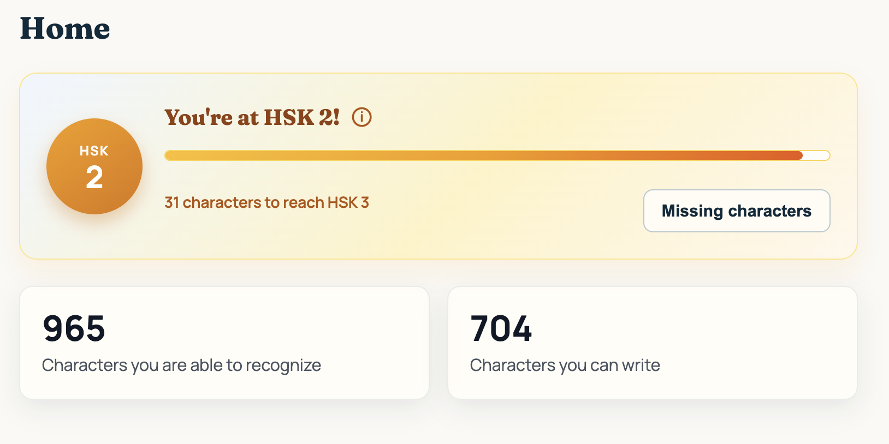
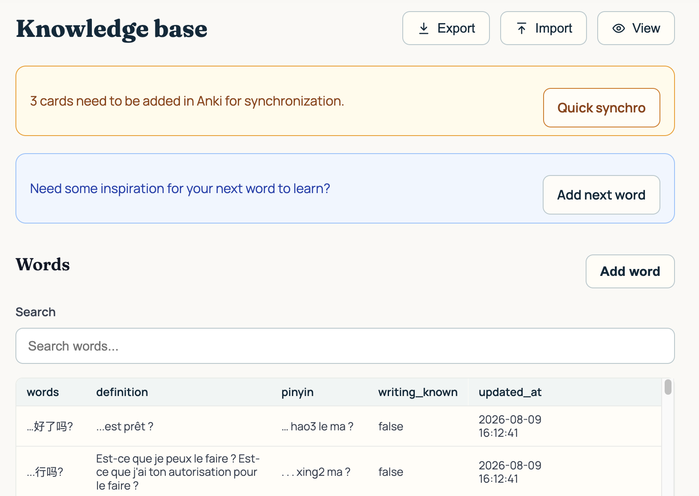
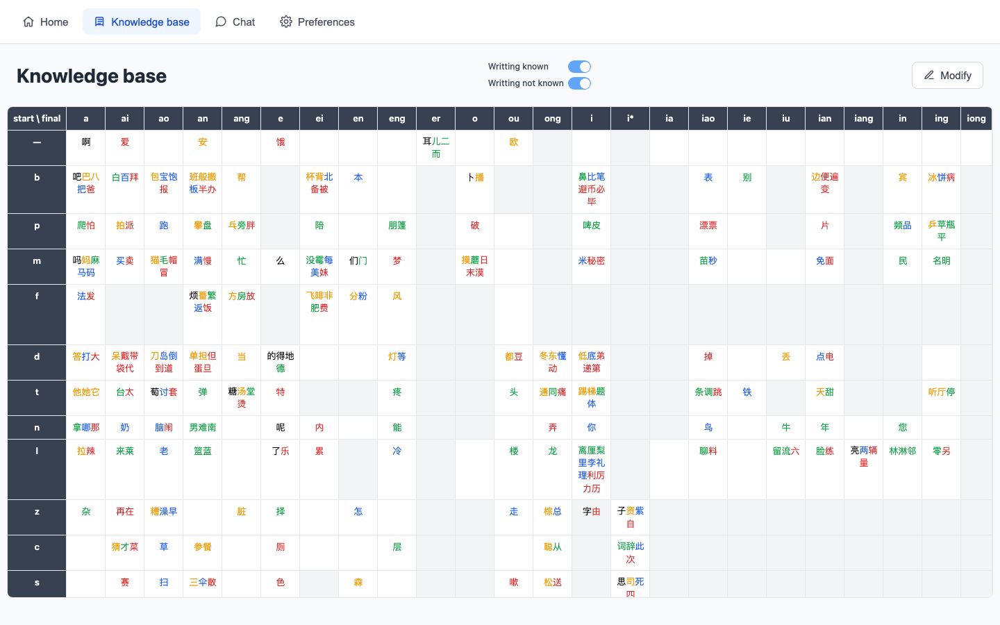
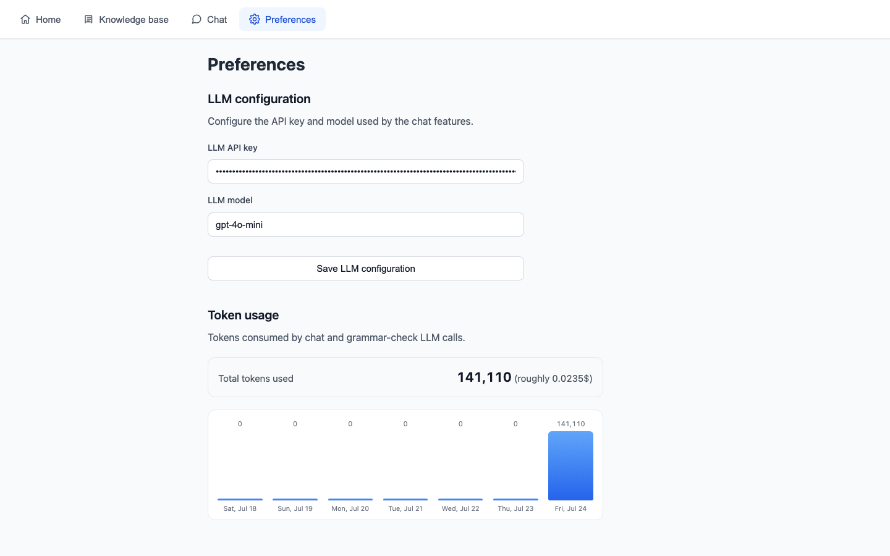
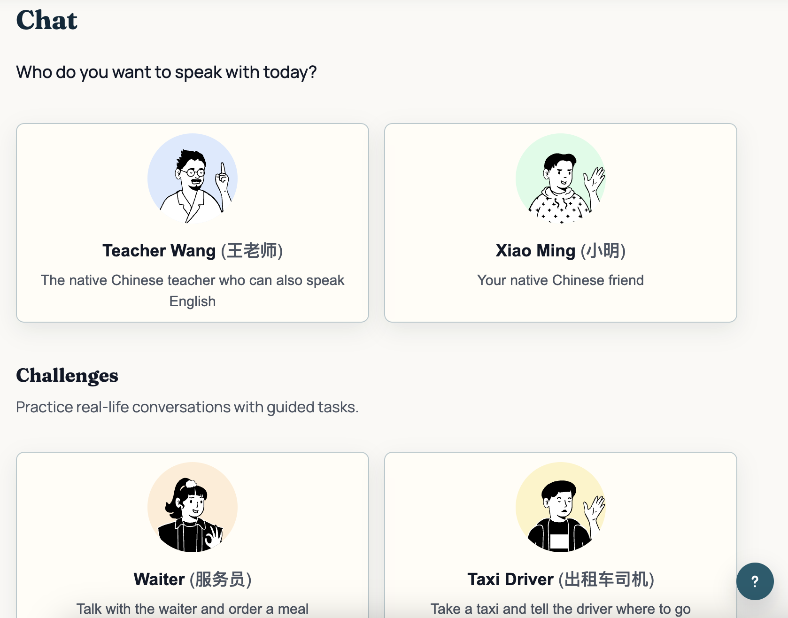
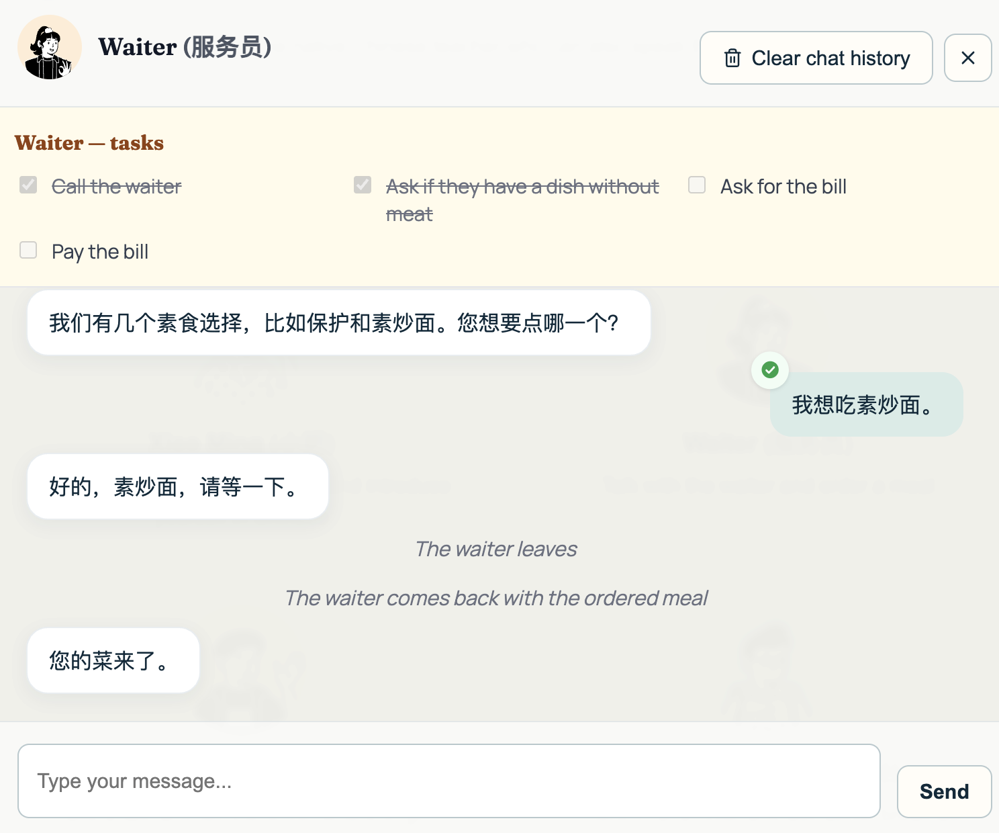

> 🚧 **Work in progress** — This repository is currently under active development. See the [roadmap](#roadmap) for planned features and progress.

Check application online: [teacherwang.xyz](https://teacherwang.xyz/) And the Overview presentation video: https://www.youtube.com/watch?v=TvgJ_hcDlrk

# teacher-wang

   

   

An app to learn Mandarin.

## Technologies

This project was intentionally developed using Cursor AI and coding agents. My objective was not only to build an AI product, but also to explore modern AI-assisted software engineering workflows.

- **Backend:** Python, Flask, SQLAlchemy, PostgreSQL (Alembic)
- **Frontend:** React, TypeScript, Vite, Redux Toolkit, react-i18next
- **AI:** LangChain (`langchain-core`, `langchain-openai`), OpenAI-compatible chat models via `ChatOpenAI`

## Project structure

```
teacher-wang/
├── backend/
│   ├── Dockerfile          # ECS image (gunicorn :5000); build from repo root
│   ├── .dockerignore
│   ├── __init__.py         # Application factory (create_app)
│   ├── app.py              # Flask entry point
│   ├── migrations/         # Alembic revisions (Postgres schema)
│   ├── hsk.json            # Bundled HSK fallback if GitHub download fails
│   ├── routes/             # One endpoint per file (Flask blueprints)
│   ├── jobs/               # CLI entrypoints for ECS tasks (generate_weekly_articles.py)
│   ├── utils/              # Everything importable from routes/tests, grouped by domain
│   │   ├── database/       # database.py (init/Alembic upgrade), alembic_runner.py, db_config.py,
│   │   │                   # extensions.py (SQLAlchemy), models.py, db_export.py, settings.py (key/value app settings)
│   │   ├── auth/           # auth.py (Cognito JWT verify), auth_config.py, cognito_public.py, cognito_admin.py, user_context.py
│   │   ├── aiChat/         # chat_service.py, chat_agents.py, llm.py, llm_config.py, behavior_spec.py,
│   │   │                   # challenge_progress.py/challenge_prompts.py/challenges.py, teaching_strategy.py,
│   │   │                   # conversation_logs.py, conversation_log_storage.py (local/S3 adapters), token_usage.py
│   │   ├── knowledgeBase/  # hsk_level.py, hsk_level_corrections.py, hsk_word_picker.py, pinyin.py,
│   │   │                   # chinese_validation.py, character_sync.py, anki_sync.py (Anki deck mapping/sync),
│   │   │                   # hsk_source.py/hsk_content_loader.py/load_hsk_content.py (HSK vocabulary load)
│   │   ├── grammar/        # grammar_content_loader.py (loads grammar.yaml/overview.yaml files from S3
│   │   │                   # into grammar_points/grammar_prerequisites/writing_practice)
│   │   ├── writing/        # writing_drafts.py (S3-backed draft load/save, conversation-logs bucket)
│   │   └── generateArticle/ # service.py (fetch + run), weekly_article_generator.py (pipeline)
│   └── requirements.txt
├── alembic.ini             # Alembic config (URL overridden from .env)
├── .env.example            # Template for local DATABASE_URL (copy to .env)
├── frontend/
│   ├── Dockerfile          # ECS image (nginx :80 + API reverse proxy)
│   ├── .dockerignore
│   ├── nginx/
│   │   └── default.conf.template  # Proxies API paths to BACKEND_UPSTREAM
│   ├── index.html
│   ├── package.json
│   ├── public/
│   │   └── anki-connect/   # Illustrative AnkiConnect setup guide images
│   ├── src/
│   │   ├── App.tsx         # App shell, auth gate, login/logout sync triggers
│   │   ├── App.module.css
│   │   ├── main.tsx        # React entry + Redux Provider
│   │   ├── i18n.ts         # react-i18next init (synchronous, bundled resources)
│   │   ├── locales/en/     # Translation JSON, one file per feature namespace
│   │   ├── styles/         # tokens.css (design tokens), globals.css (reset/base)
│   │   ├── store/          # Redux Toolkit store (characters, words, HSK, grammar, Anki)
│   │   ├── pages/          # Welcome auth, Home, Knowledge base, Grammar, Chat, Preferences (each with a co-located .module.css)
│   │   ├── components/     # Navbar, ProfileMenu (Synchro / Log out), modals, … (each with a co-located .module.css)
│   │   │   ├── Button.tsx      # The app's only button; kind (cancel/confirm/danger) × variant (page/modal/banner/table/confirmation)
│   │   │   └── shared.css      # Global (non-module) CSS for the modal chrome, toggle switch, and Button design system
│   │   ├── types/
│   │   └── utils/
│   │       ├── apiBase.ts      # API_BASE = "/api" for Flask calls
│   │       ├── formatMarkdownText.tsx  # Shared chat/grammar Markdown-ish renderer
│   │       ├── auth/           # Cognito auth client + apiFetch
│   │       ├── anki/           # AnkiConnect (localhost:8765) + /api/anki bookkeeping
│   │       ├── knowledgeBase/  # Words, characters, HSK helpers
│   │       ├── grammar/        # Grammar points API
│   │       ├── writing/        # Sentence splitting, check/draft APIs
│   │       └── aiChat/         # Chat and token usage APIs
│   ├── tsconfig.json
│   ├── tsconfig.node.json
│   └── vite.config.ts      # Dev server; proxies /api → Flask (strip prefix)
├── scripts/
│   └── push-ecr.sh         # Build/push arm64 images to AWS ECR
├── docs/                   # Doc map: docs/README.md
│   ├── adr/                # Architecture Decision Records (+ archived/)
│   ├── architecture/       # Schema tenancy, conversation logs
│   ├── deployment/         # ECS / container reference
│   ├── anki/               # Sync protocol + setup screenshots
│   └── screenshots/        # UI screenshots used in this README
├── .cursor/
│   ├── rules/              # Durable coding instructions for agents
│   └── skills/             # Reusable workflows (ECR, challenges, …)
├── AGENTS.md               # Short agent entrypoint (points at rules + docs)
└── README.md
```

## Architecture decisions

Full map: [docs/README.md](docs/README.md). ADRs:

- [AnkiConnect bridge](docs/adr/anki-connect.md) — why the React client talks to local AnkiConnect instead of AnkiWeb
- [Anki ↔ knowledge-base sync](docs/adr/anki-sync.md) — push / pull orchestration (steps: [sync protocol](docs/anki/sync-protocol.md))
- [Multi-agent chat](docs/adr/ai-agents.md) — character, grammar teacher, and challenge judge collaboration
- [Weekly articles generation](docs/adr/weekly-articles.md) — per-HSK-level article picking, adaptation, and new-word flagging pipeline
- [PostgreSQL](docs/adr/postgres.md) — Alembic schema, `DATABASE_URL` / `TEST_DATABASE_URL`
- [Authentication & credentials](docs/adr/auth.md) — Cognito User Pool for credentials; thin Postgres profile by `sub`
- [Data isolation](docs/adr/data-isolation.md) — `user_id` in every private primary key, hash partitions, shared HSK catalog
- [Plan management](docs/adr/plan-management.md) — free vs paid, `available_token` budget, enforcement on LLM invokes
- [Frontend CSS organization](docs/adr/frontend-styling.md) — CSS Modules per component, `shared.css` design system, the `Button` component
- [Frontend localization](docs/adr/frontend-localization.md) — react-i18next, synchronous init, one translation namespace per feature area
- [Grammar content architecture](docs/adr/grammar-content.md) — content in Git/S3 vs. metadata and learner progress in Postgres, prerequisite resolution
- [Writing practice](docs/adr/writing-practice.md) — topics anchored to grammar lessons, sentence-level checks reusing chat's grammar correction, S3 drafts, deferred grammar-usage recording

Obsolete decisions: [`docs/adr/archived/`](docs/adr/archived/), for example [SQLite → PostgreSQL](docs/adr/archived/sqlite-to-postgres.md).

## Getting started

### Backend

From the project root:

```bash
python3 -m venv venv
source venv/bin/activate
pip install --upgrade pip
python3 -m pip install -r backend/requirements.txt
python3 -m backend.app
```

The API runs at `http://localhost:5000` by default. Set the `PORT` environment variable to use a different port:

```bash
PORT=8080 python3 -m backend.app
```

#### Tests

Backend tests require PostgreSQL via `TEST_DATABASE_URL` (see `.env.example`). Create the test database once, then from the project root:

```bash
python3 -m unittest discover -s backend/tests -v
python3 backend/test_coverage.py
python3 -m unittest discover -s backend/tests -p "<my_test_file>.py" -v
```

From the `backend/` directory:

```bash
make test-coverage
```

GitHub Actions starts a Postgres 15 service and sets `TEST_DATABASE_URL` automatically.

The coverage report is written to `backend/coverage/` (open `coverage/index.html` in a browser for the HTML report).

#### Database

Local development targets **PostgreSQL** via `DATABASE_URL` in a gitignored `.env` (copy from `.env.example`). Backend tests use a separate `TEST_DATABASE_URL` (for example `teacher_wang_test`) so they never touch your app data:

```bash
cp .env.example .env
# DATABASE_URL=.../teacher_wang
# TEST_DATABASE_URL=.../teacher_wang_test

PGPASSWORD=1234 psql -h localhost -p 5432 -U postgres \
  -c 'CREATE DATABASE teacher_wang;'
PGPASSWORD=1234 psql -h localhost -p 5432 -U postgres \
  -c 'CREATE DATABASE teacher_wang_test;'
python3 -m pip install -r backend/requirements.txt
python3 -m alembic upgrade head   # also runs automatically on app start
```

Schema is managed with **Alembic** (`backend/migrations/`). Decision notes: [PostgreSQL](docs/adr/postgres.md). Table catalog and partition layout: [schema tenancy](docs/architecture/schema-tenancy.md). Isolation rationale: [data isolation](docs/adr/data-isolation.md).

On first start the app seeds the shared HSK content; each user's default settings are seeded on their first authenticated request. Learner data is private per Cognito user (`user_id`); HSK tables are shared.

You can preload your characters and words with the bulk upload endpoint (see below), for example:

```bash
curl -X POST -F "file=@db.txt" \
  -H "Authorization: Bearer $COGNITO_ACCESS_TOKEN" \
  http://127.0.0.1:5000/characters/bulk
```

#### LLM configuration (operators only — never exposed to users)

**Rule:** `LLM_API_KEY` and `LLM_MODEL` are infrastructure / operator secrets. They must **never** be readable or writable through the API or the frontend UI. There is no `/llm-config` endpoint.

| Key / variable | Description |
| --- | --- |
| `LLM_API_KEY` | API key for the LLM provider |
| `LLM_MODEL` | Model name to use (for example `gpt-5.6-luna`) |

- **Production / ECS:** set these as task-definition secrets / environment variables in [teacher-wang-infra](https://github.com/mazarsju/teacher-wang-infra).
- **Local development:** the same env vars, or a gitignored `.config.txt` at the project root (read by `backend/utils/aiChat/llm_config.py` as a convenience fallback).

`POST /admin/articles/generate` and the ECS job `python3 -m backend.jobs.generate_weekly_articles` both call `run_weekly_article_generation()` in `backend/utils/generateArticle/service.py`. That service fetches China-related news from one of two sources, chosen by the hardcoded `ARTICLE_SOURCE` flag (currently `"guardian"`) — not an env var, since it's a code-level choice, not a per-environment secret:

| Key / variable | Description |
| --- | --- |
| `CURRENTS_API_KEY` | [Currents API](https://currentsapi.services/) key (used when `ARTICLE_SOURCE = "currents"`) |
| `GUARDIAN_API_KEY` | [The Guardian Open Platform](https://open-platform.theguardian.com/) key (used when `ARTICLE_SOURCE = "guardian"`) |

Both are read the same way as `LLM_API_KEY` above (`.config.txt` first, then the environment variable).

Use `backend.llm.get_llm()` to obtain a cached chat model instance. Values are read from `.config.txt` first (if present), then from environment variables.

#### Free-plan token budget

Free accounts (`users.plan = free`) get a lifetime **100 000**-token allowance (`settings.available_token`), enforced on every LLM invoke. Preferences shows remaining vs max; historical usage lives in `token_count`. Design notes: [plan management](docs/adr/plan-management.md).

#### AnkiConnect

Preferences map knowledge-base decks to Anki through [AnkiConnect](https://git.sr.ht/~foosoft/anki-connect) (add-on `2055492159`). Anki must be running locally; the **frontend** talks to `http://127.0.0.1:8765` — set `webCorsOriginList` to allow the app origin (e.g. `["*"]` or `http://localhost:5173`). Deck mappings live in `settings` via Flask routes.

Design notes: [AnkiConnect bridge](docs/adr/anki-connect.md), [sync orchestration](docs/adr/anki-sync.md), [sync protocol](docs/anki/sync-protocol.md). Setup images: [docs/anki/setup/](docs/anki/setup/).

#### API endpoints

Every route below except `/health` requires `Authorization: Bearer <cognito_access_token>` (plus the optional `X-Id-Token` companion header) and only ever reads or writes the authenticated user's rows — see [data isolation](docs/adr/data-isolation.md).

| Method | Route | Description |
| --- | --- | --- |
| `GET` | `/health` | Health check (`200` + DB up, or `503` if Postgres is unreachable) — the only public route |
| `GET` | `/auth/me` | Current user (`username`, `email`, `plan`, `is_admin`) from the `users` row |
| `GET` | `/token-usage` | Token history (`total_tokens`, `days`, …) plus `plan`, `available_token`, and `max_allowed_token` (100000 on free, else `null`) |
| `GET` | `/weekly-articles` | This week's `weekly_articles` content for the caller's stored HSK level (clamped to 1-6; `content` is `null` if not generated yet) |
| `GET` | `/preferences/smart-ai` | Current Smart AI preference (`{ "enabled": bool }`, default `true`) — see [Smart AI toggle](docs/adr/ai-agents.md#smart-ai-toggle-light-vs-full-pipeline) |
| `PATCH` | `/preferences/smart-ai` | Set the Smart AI preference (`{ "enabled": bool }`) |
| `GET` | `/anki/status` | Mandarin vocabulary/writing deck mapping status and pending push estimate (DB only; frontend adds AnkiConnect reachability) |
| `POST` | `/anki/decks/setup` | Persist a mandarin_vocabulary/mandarin_writing deck, deck type, and field mapping |
| `GET` | `/anki/sync/data/<kind>` | Push candidates, ignore keys, and local word/character snapshot for frontend sync orchestration |
| `POST` | `/anki/sync/mark-synchronized` | Mark words/characters synchronized after a frontend Anki push (or cancel) |
| `POST` | `/anki/sync/pull-apply` | Import pull cards into the knowledge base and/or record ignore keys |
| `POST` | `/chat` | Send a chat message to the selected AI character (persists to the user-scoped log store), or pass `ephemeral: true` (Teacher Wang only, no `thread_id`) for a one-off reply that isn't persisted — used for the grammar-exercises "More explanation" button and the grammar Explanation tab's "Ask more information to Teacher Wang" chat; the latter also passes `context` (a lesson's title + Markdown), folded into Teacher Wang's system prompt so the reply stays scoped to that lesson |
| `GET` | `/conversation-logs/<character_id>` | Load this user's chat transcript (and challenge task progress when applicable) |
| `POST` | `/conversation-logs/<character_id>` | Create an empty conversation log (`409` if it already exists) |
| `PATCH` | `/conversation-logs/<character_id>` | Replace the transcript (`{ "messages": [...] }`) |
| `DELETE` | `/conversation-logs/<character_id>` | Delete the transcript, correction threads, challenge progress, and stored conversation summary |
| `GET` | `/chat/history/<character_id>` | Legacy alias for `GET /conversation-logs/<character_id>` |
| `GET` | `/characters` | List all characters |
| `POST` | `/characters` | Create a new character |
| `PATCH` | `/characters/<char>` | Update a character's `pinyin` and `writing_known` |
| `DELETE` | `/characters/<char>` | Delete a character |
| `POST` | `/characters/bulk` | Upload a `.txt` file (`multipart/form-data`, field name `file`) |
| `POST` | `/characters/bulk-create` | Create up to 100 characters at once (`{ "characters": [...] }`) |
| `GET` | `/words` | List all words |
| `POST` | `/words` | Create a new word (characters in the word must already exist) |
| `POST` | `/words/bulk-create` | Create up to 100 words at once (`{ "words": [...] }`) |
| `PATCH` | `/words/<word>` | Update a word's `definition` |
| `DELETE` | `/words/<word>` | Delete a word |
| `GET` | `/hsk-characters` | List HSK characters with level and frequency |
| `GET` | `/grammar-points` | Returns `{ grammar_points, writing_practices }`: grammar points (`grammar_points`/`grammar_prerequisites`) with the current user's `status` and `score` from `user_grammar_progress`, ordered by HSK level then the numeric folder prefix in `s3_key` (`index`); and every `writing_practice` row (`id`/`title`/`after_grammar_point`), the catalog the Grammar tab uses to insert "Practice: `<title>`" rows after their grammar point (Postgres only, no S3 content) |
| `POST` | `/grammar-points/<grammar_id>/skip` | Mark a grammar point as already known (`status` = `SKIP` in `user_grammar_progress`), unlocking grammar points that list it as a prerequisite |
| `GET` | `/grammar-points/<grammar_id>` | Fetch one grammar point's detail: Postgres metadata plus its `explanation.md`/`exercises.json` content read from the `GRAMMAR_CONTENT_S3_BUCKET` bucket (or `GRAMMAR_CONTENT_S3_PATH` local checkout) at its `s3_key`, plus `new_words` — the point's `grammar.yaml` word list resolved against `hsk_words` (lowest level/frequency per word) for the Vocabulary tab |
| `POST` | `/grammar-points/<grammar_id>/complete` | Save a finished exercises quiz: sets `status` to `DONE` (score ≥ 80) or `WIP` (below 80), plus `score` (rounded percentage) and `last_practiced_at`, in `user_grammar_progress` |
| `POST` | `/grammar-points/check` | Given a text (`{ "text": "..." }`), ask the LLM which `DONE` grammar points it uses. `pro` plan only. With `"check_only": true` (writing practice), just returns `grammar_points_covered` as `{id, title}` pairs and records nothing — pair with `/grammar-points/record-usage`. Without it (chat), increments `usage_in_real_life` inline, flips `status` to `MASTERED` after 3 uses, and returns `grammar_points_covered` (titles) and `new_grammar_points_mastered` |
| `POST` | `/grammar-points/record-usage` | Takes `{ "grammar_ids": [...] }` (one entry per usage) and applies the same increment/`MASTERED`-at-3 logic as `/grammar-points/check`, for usages already detected via `check_only` |
| `GET` | `/writing-practice/<topic_id>` | Fetch everything for one writing-practice topic: `title` from `writing_practice`; `context` — its `context.md` content read from the `GRAMMAR_CONTENT_S3_BUCKET` bucket (or `GRAMMAR_CONTENT_S3_PATH` local checkout) at `writing_practice/<topic_id>/`; and the caller's `draft`/`archive` (see `POST` below) |
| `POST` | `/writing-practice/<topic_id>` | Save the caller's current draft text for this topic (`{ "draft": "..." }`) to S3, preserving `archive` |
| `POST` | `/writing-practice/<topic_id>/complete` | Save a fully-corrected draft and append it to `archive` with a timestamp (`{ "draft": "..." }`) |
| `GET` | `/hsk-characters/<character>/words` | List HSK words linked to a character |
| `POST` | `/database/export` | Export the knowledge base to a `.txt` file |
| `GET` | `/admin/users` | List all users' `email` and `plan` (`403` unless the caller is the admin account) |
| `PATCH` | `/admin/users/<id>` | Set a user's `plan` to `free`/`pro` (`403` unless the caller is the admin account); switching to `pro` grants 10,000,000 tokens, switching to `free` resets to 100,000 |
| `POST` | `/admin/articles/generate` | Same as `python3 -m backend.jobs.generate_weekly_articles`: fetch latest China-related articles (Currents API or The Guardian, per the hardcoded `ARTICLE_SOURCE` flag); for each HSK level 1-6, pick/adapt/save to `weekly_articles` (`403` unless the caller is the admin account) |
| `POST` | `/admin/grammar/reload` | Read every `grammar.yaml` and `writing_practice/*/overview.yaml` from the `GRAMMAR_CONTENT_S3_BUCKET` bucket (see [teacher-wang-grammar](https://github.com/mazarsju/teacher-wang-grammar)), or from a local checkout at `GRAMMAR_CONTENT_S3_PATH` if set (local debugging, skips S3), and repopulate `grammar_points`/`grammar_prerequisites`/`writing_practice`, rewriting `user_grammar_progress` for ids that still exist (`403` unless the caller is the admin account) |

### Frontend

From the project root:

```bash
cd frontend
npm install
npm run dev
```

The app runs at `http://localhost:5173`. Vite proxies `/api/*` to the backend (stripping the `/api` prefix) during development. AnkiConnect stays on `http://127.0.0.1:8765` (browser → local Anki); Flask Anki bookkeeping uses `/api/anki/…`.

#### Client state (Redux Toolkit)

Important learner data is kept in a Redux store so navigating between tabs does not re-hit the API for the same payload. On **login** (and when restoring an existing session), and when the user clicks **Synchro** in the profile menu (above Log out), the app refreshes:

| Slice | Source |
| --- | --- |
| Characters | `GET /characters` |
| Words | `GET /words` |
| HSK level | `GET /hsk-level` |
| Anki status | `GET /anki/status` (+ local AnkiConnect when available) |

Home, Knowledge base, and Preferences read from that store. Mutations (add / edit / delete) update the store after a successful API call. Logout clears the store. Chat transcripts, token-usage charts, and other ephemeral UI state are not cached this way. LLM credentials are never stored in Redux (see [LLM configuration](#llm-configuration-operators-only--never-exposed-to-users)).

Weekly articles (`GET /weekly-articles`) and grammar points / writing practices (`GET /grammar-points`) follow a lazier pattern instead: Home and Grammar fetch them once on first visit and cache the result in their own slice (`weeklyArticle`, `grammar`), so navigating away and back does not refetch. They still clear on logout along with the rest of the store.

#### Tests

From the `frontend/` directory:

```bash
npm test
npm run test:coverage
```

The coverage report is written to `frontend/coverage/` (open `coverage/index.html` in a browser for the HTML report). On GitHub, badges in this README are updated automatically on each push to `main`, and the full HTML reports are published at [mazarsju.github.io/teacher-wang](https://mazarsju.github.io/teacher-wang/) ([frontend](https://mazarsju.github.io/teacher-wang/frontend/), [backend](https://mazarsju.github.io/teacher-wang/backend/)).

To enable the hosted report, go to **Settings → Pages** and set **Build and deployment → Source** to **Deploy from a branch**, then choose branch **`gh-pages`** and folder **`/ (root)`**. The workflow creates and updates that branch automatically.

## AI logic

Chat turns are not a single LLM call: a character agent, grammar teacher, and (for challenges) a judge collaborate on each message. Full decision notes, including the interaction diagram, are in [docs/adr/ai-agents.md](docs/adr/ai-agents.md).

## Feature

### Track your progress

See at a glance where you stand on the HSK ladder—and exactly which characters still stand between you and the next level.



### Update your knowledge base

Add words in a clean edit view — matching characters are created automatically — then switch to a pinyin grid that turns your vocabulary into a visual map of progress.



Browse every character you know, grouped by pinyin, for a motivating snapshot of how far you've come.



### Practice your skills with AI agents

Discuss with predefined chat agents to practice your level (LLM access is configured by the operator in infrastructure, not in the app UI).







Step into real scenes: role-play with characters like the waiter, clear the checklist, and win the challenge in Mandarin.

## Roadmap

### 1. Character overview ordered by pinyin

An overall view of the characters you know, sorted by pinyin.

- [x] Simple frontend connected with backend
- [x] Database structure for characters, and loading the DB with characters you already know
- [x] Create different tabs in the frontend: Home, Knowledge base, Chat, Preferences
- [x] Simple CRUD interface to manage characters
- [x] Visualization of characters by pinyin
- [x] UI polish with additional options: different color for the tones, a toggle to show or hide characters you only recognize (not write), mouse hover effect...
- [x] Add home page with some progress KPIs

### 2. Chinese-only chatbot (known characters)

A chatbot that speaks Chinese using only the characters you are supposed to know.

- [x] LLM integration with config management
- [x] Minimalist UI to have a list of chats and navigate through them
- [x] AI chatbot remembering the previous answer (non-persistent through sessions)
- [x] AI chatbot remembering the previous answer (persistent through sessions)
- [x] Add constraint for the agent to use only the known vocabulary
- [x] Improve teacher wang character responses using planner and verification check
- [x] Compact conversation history

### 3. Multi-agent conversations for specific topics

Several agents collaborating around focused learning scenarios.

- [x] Add a grammar checker for each conversation, explaining the mistakes to the user in a separate thread
- [x] Conversation scenarios with a defined goal to achieve
- [ ] Add words to practice on challenges

### 4. Anki integration

Ease the process of synchronization between the app knowledge base and Anki.

- [x] Add a connection to Anki in the setting section
- [x] Make it possible to add new characters / words to your Anki collection (way "out")
- [x] Make it possible to load your Anki collection to your current database (way "in")
- [x] Add a whole wizard for the first connexion to help the user to populate his knowledge base

### 5. Cloud deployment

Host the web app so learners can use it without a local install. Infrastructure lives in [teacher-wang-infra](https://github.com/mazarsju/teacher-wang-infra) (Terraform → VPC, RDS, ECR, optional ECS + ALB).

- [x] Separate frontend and backend container images (`frontend/Dockerfile`, `backend/Dockerfile`)
- [x] Script to build `linux/arm64` images and push to ECR (`scripts/push-ecr.sh`)
- [x] Enable ECS in infra and wire LLM secrets / HTTPS

### 6. Multi-user auth & data isolation

Several learners can sign in; each owns private data, while shared catalogs stay read-only. Design notes: [auth](docs/adr/auth.md), [data isolation](docs/adr/data-isolation.md), infra [multi-user](https://github.com/mazarsju/teacher-wang-infra/blob/main/docs/multi-user-archi-decision.md).

- [x] Cognito User Pool in infra (app client; optional Google IdP) wired into ECS
- [x] Welcome auth UI — username/password login & sign-up, plus Google SSO (Hosted UI + PKCE)
- [x] Flask JWT verification on every route; `users` table keyed by Cognito `sub`
- [x] Per-user private tables (`user_id` in PK, hash-partitioned) with shared HSK catalog
- [x] Frontend attaches Cognito tokens on API calls; per-user conversation logs (S3 / local)

### 7. Improve UX/UI

Keep the app feeling snappy and polished as datasets and features grow — clearer feedback, smoother navigation, and a more cohesive look.

- [x] Cache core learner data in Redux so tab switches do not re-fetch (refresh on login / profile **Synchro**)
- [x] Avatar design improvement
- [x] General webapp design improvement
- [x] Use CSS components to better organize styling

### 8. Plan management

Differentiate free and paid tiers so AI chat can scale without unbounded cost. Design notes: [plan management](docs/adr/plan-management.md).

- [x] `users.plan` defaults to `free`; free accounts get a 100 000-token `available_token` budget
- [x] Gate and deduct on every backend LLM invoke; chat surfaces a clear exhaustion message
- [x] Preferences shows remaining tokens (progress bar); hide estimated $ cost
- [ ] Add payment subscription (upgrade / renew / cancel) and paid-plan entitlements

### 9. Nice-to-have features

Smaller additions that aren't part of a bigger initiative but are still worth doing.

- [x] Weekly Chinese-related article adapted to the learner's HSK level

### 10. Grammar learning

Dedicated grammar path by HSK level, with exercises and a loop back into chat so theory sticks through real use.

- [x] Define HSK1 grammar curriculum and grammar-point metadata structure
- [x] Create grammar content repository and S3 deployment pipeline
- [x] Design database schema for grammar catalog, prerequisites, and learner progress
- [x] Load the database with grammar metadata based on S3 content
- [x] Build grammar section UI with HSK-level navigation (list view; explanation view still pending)
- [x] Display grammar explanations from S3 (Markdown rendering)
- [x] Track grammar completion and mastery per user
- [x] Add deterministic exercises
  - [x] Multiple-choice questions
  - [x] Sentence reordering
  - [x] Sentence transformation
- [x] Add translation exercises with AI-assisted validation
- [x] Add AI-powered explanation if the user makes some mistakes in exercises
- [x] Add AI tutor mode for grammar-specific questions and explanations
- [x] New way of training grammar rules: writing practice
- [x] Integrate learned grammar points into AI conversations, challenges and writing practice
  - Detects grammar rules used correctly in chat and counts them toward mastery
  - After 3 real-life uses, a grammar point's status flips to `MASTERED` (blue badge, star icon)
- [x] Create complete HSK1 grammar content
- [x] Create complete HSK2 grammar content
- [x] Create complete HSK3 grammar content
- [x] Create complete HSK4 grammar content

### 11. Multi-language management

The app UI and explanations are English-only today. Learners should be able to pick another base language (still learning Mandarin) so prompts, corrections, and labels match how they think.

- [x] Add `react-i18next` and configure a global localization framework in the React application
- [x] Extract all frontend UI texts into translation files organized by feature (`home`, `chat`, `knowledge-base`, `preferences`, `common`)
- [x] Internationalize backend-generated content (LLM prompts, AI explanations, etc.)
- [ ] Internationalize application data stored in PostgreSQL (HSK descriptions)
- [ ] Internationalize static content stored outside the application (S3-hosted content)
- [ ] Define a language-aware architecture across frontend, backend, APIs, database, and AI services
- [ ] Add French as the first additional language and validate the full localization workflow end-to-end
- [ ] Add a language switcher in the UI and persist the user's preferred interface language

### 12. Gamification

Light rewards so progress feels visible without turning the app into a points grind.

- [ ] Badge / reward catalog tied to meaningful actions (e.g. first chat, challenge completed, grammar chapter cleared, streak)
- [ ] Award and display badges on the profile / home progress area
- [ ] Notifications or toasts when a new badge is unlocked

### 13. Peer chat (real persons)

Let learners practice with each other, not only with AI agents — with clear presence, consent, and safety controls.

- [ ] Show who is currently online at a similar HSK / knowledge level
- [ ] Opt-in “available to talk” status (visible to eligible peers)
- [ ] 1:1 chat sessions between two learners
- [ ] Block a user so they can no longer contact you

### 14. Interactive games with Xiao Ming

Short playful games in chat to reinforce vocabulary and comprehension alongside free conversation.

- [ ] “Who am I thinking about?” — Xiao Ming thinks of a person/character; learner asks yes/no (or constrained) questions
- [ ] “Who am I?” — learner or Xiao Ming takes a role; the other guesses from clues in Chinese
- [ ] Game session UI in chat (rules, turn state, win/lose) without leaving the conversation flow

#### Push images to AWS ECR (from this Mac)

ECS uses Graviton (`t4g`) — images must be **`linux/arm64`**. Ports, proxy, and healthchecks: [ECS containers](docs/deployment/ecs-containers.md). Full push + redeploy workflow: Cursor skill **update-ecr-images** (`.cursor/skills/update-ecr-images/`).

```bash
# Preferred: login, build/push, and force ECS redeploy
.cursor/skills/update-ecr-images/scripts/push.sh           # both
.cursor/skills/update-ecr-images/scripts/push.sh backend
.cursor/skills/update-ecr-images/scripts/push.sh frontend

# Or build/push only (requires ECR_* / Cognito env from infra Terraform outputs)
./scripts/push-ecr.sh
```

Push images **before** (or right after) setting `enable_ecs = true` in infra, or tasks will fail to pull.
