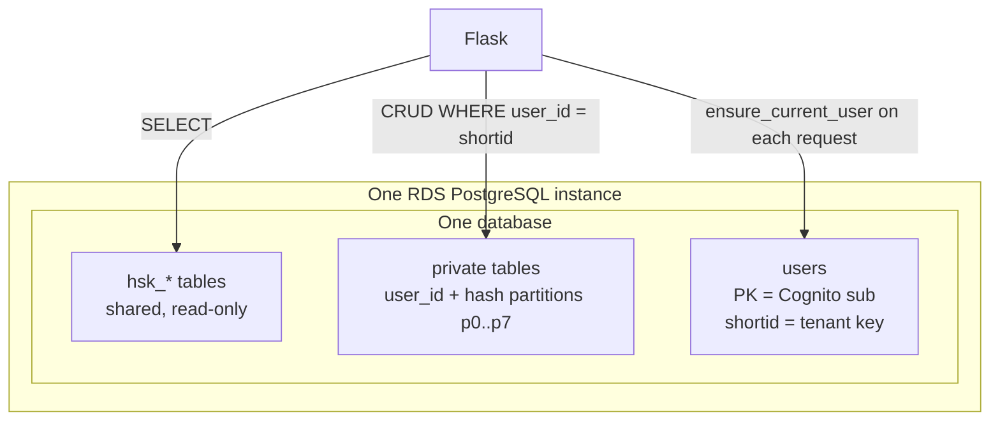

# Data Isolation Architecture

## Status

Accepted — implemented by Alembic revision `9c4b71e0a2d5` (`users` table + hash-partitioned private tables), `c3d4e5f6a7b8` / `d5e6f7a8b9c0` (`users.shortid` as private-table tenant key), and the request-scoped tenant resolution in `backend/user_context.py`. RLS remains a documented follow-up.

Aligned with Decisions 2 and 3 in [teacher-wang-infra multi-user architecture](https://github.com/mazarsju/teacher-wang-infra/blob/main/docs/multi-user-archi-decision.md). Credentials live in Cognito; see [auth ADR](./auth.md). Coding invariants: `.cursor/rules/multi-tenant.mdc`. Table/PK catalog: [schema tenancy](../architecture/schema-tenancy.md). Conversation log paths: [conversation logs](../architecture/conversation-logs.md).

## Context

Once multiple learners sign in, each user’s private data (knowledge base progress, settings, Anki bookkeeping, token accounting, …) must stay private. The HSK catalog is **shared read-only** for everyone.

Constraints inherited from infra / product:

| Topic | Answer |
| --- | --- |
| Tenancy grain | **1 user = 1 data owner** |
| Topology | One RDS instance, one application database |
| Shared data shape | Relational text for now (no large blobs) |
| Who writes shared data | Operator via migrations / seeds only |
| Scale posture | Tens to low hundreds of users first |

## Decision

| Concern | Choice |
| --- | --- |
| Account identity | `users.id` **is the Cognito `sub`** — stable across username/email changes |
| Tenant key for private data | `users.shortid` (NUMERIC, sequence-backed, unique) — every private table's `user_id` FKs to it |
| Per-user private data | One DB, one schema; every private table carries `user_id` as the **first primary-key column** and a FK to `users.shortid`, and is **`PARTITION BY HASH (user_id)` with `MODULUS 8`** (`p0`…`p7`) |
| Shared catalog | Same DB, plain (unpartitioned) `hsk_*` tables, no `user_id` |
| Isolation enforcement | **Application-level filtering** today: `current_user_id()` (returns `shortid`) on every private query. PostgreSQL RLS stays a follow-up backstop |
| Escape hatches | Schema-per-user or database-per-user on the same RDS **only if** partitioning proves insufficient |

### Tenant resolution on every request

`register_user_context(app)` installs a `before_request` hook (`backend/user_context.py`):

1. `OPTIONS` requests and `/health` are public. Everything else requires `Authorization: Bearer <access_token>`; a missing or invalid token is a `401`.
2. The verified claims land in `g.cognito_claims` / `g.cognito_sub`.
3. `ensure_current_user()` upserts the `users` row for that `sub`, takes the email from the optional verified `X-Id-Token` companion header, and refreshes `last_connexion`.
4. A brand-new user gets their default `settings` rows seeded lazily right there — there is no global tenant bootstrap at app boot any more.
5. `current_user_id()` then serves the tenant key (`users.shortid`) to routes and services for the rest of the request.

The frontend sends both tokens through `frontend/src/utils/auth/apiFetch.ts`.

### Defense in depth

| Layer | Status |
| --- | --- |
| Application filters by authenticated `user_id` (`shortid`) | **Done** — every private query goes through `current_user_id()` |
| `user_id` is part of every private primary key | **Done** — a cross-user collision is a constraint violation, not silent corruption |
| PostgreSQL RLS as a backstop (`SET LOCAL app.user_id = …`) | **Follow-up** |
| Separate `app` vs `migrator` DB roles | **Follow-up** (infra) |

### Roles (target, with infra)

| Role | Usage | Privileges |
| --- | --- |
| `app` (ECS task) | Normal API | `SELECT` on HSK tables; CRUD on private tables |
| `migrator` / admin | Alembic, seeds | DDL + write to HSK tables |

## Migration from single tenant

Revision `9c4b71e0a2d5` (after `376edc4d57aa`) **drops and recreates** the private tables rather than backfilling an owner. The app was still single-tenant and pre-production, so existing characters/words are re-imported per user through the bulk import; the HSK tables are untouched. `downgrade()` restores the previous unpartitioned, un-scoped shape (also destructively).

Revision `c3d4e5f6a7b8` adds `users.shortid`. Revision `d5e6f7a8b9c0` remaps private `user_id` columns onto `shortid`, recreates the hash partitions, and drops `character_word`.

## Out of scope (for now)

* Org / class multi-tenancy (`tenant_id`).
* Per-user backup/restore or certified isolation.
* Separate RDS for shared content or S3 for shared blobs.
* Schema- or DB-per-user as day-one design.

## Consequences

### Advantages

* One Alembic history and one connection string keep ops cheap on `db.t4g.micro`.
* Cognito `sub` stays the account primary key; `shortid` keeps private-table keys and partition hashes compact and stable.
* `user_id` sits in every private primary key and in the partition key, so per-user reads prune partitions and cross-user writes cannot collide.
* New users need no provisioning step: the first authenticated request creates the row and its default settings.

### Drawbacks / follow-ups

* A forgotten `WHERE user_id = …` is still a leak risk until RLS is enabled — the app filter is currently the only guard.
* Changing the partition modulus later requires a rewriting migration.
* `email` is `NOT NULL UNIQUE`, so users authenticated without an ID token carry a `{sub}@users.local` placeholder until a request supplies a verified email.

### Known gaps (not covered by this decision yet)

State that lives outside Postgres and is still **shared between all users**:

| What | Where | Note |
| --- | --- | --- |
| Knowledge-base export | `backend/db_export.py` writes one file per deployment | Contents are user-scoped, the filename is not |
| LLM API key / model | ECS secrets / env (local: `.config.txt`) | Operator-level only — never exposed via API or UI |

Knowledge-base export still needs either a `user_id` path segment or a move into a private table before the app is opened to real multi-user traffic.
