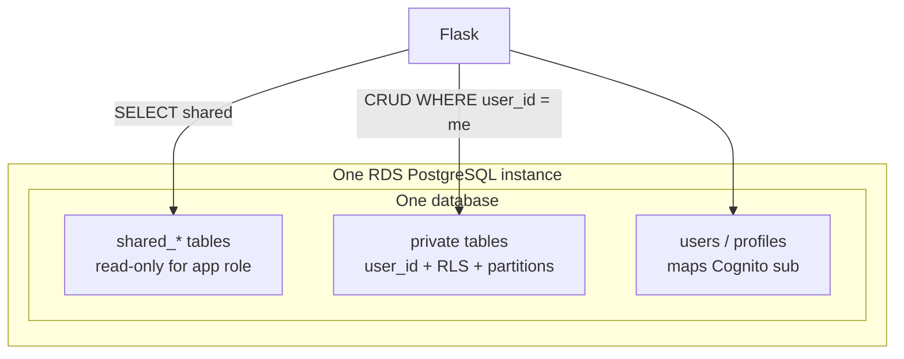

# Data Isolation Architecture

## Status

Proposed — **placeholder; to be updated** with Alembic schema details, exact partition strategy, RLS policy SQL, and migration of today’s single-tenant tables.

Aligned with Decisions 2 and 3 in [teacher-wang-infra multi-user architecture](https://github.com/mazarsju/teacher-wang-infra/blob/main/docs/multi-user-archi-decision.md). Credentials live in Cognito; see [auth-archi-decision.md](auth-archi-decision.md).

## Context

Once multiple learners sign in, each user’s private data (knowledge base progress, settings, chat history, Anki bookkeeping, etc.) must stay private. Some content (e.g. HSK catalog seeds) should remain **shared read-only** for everyone.

Constraints inherited from infra / product:

| Topic | Answer |
| --- | --- |
| Tenancy grain | **1 user = 1 data owner** |
| Topology | One RDS instance, one application database |
| Shared data shape | Relational text for now (no large blobs) |
| Who writes shared data | Operator via migrations / seeds only |
| Scale posture | Tens to low hundreds of users first |

## Decision (locked defaults — detail TBD)

| Concern | Choice |
| --- | --- |
| Per-user private data | **One DB**, shared schema, every private row tagged with **`user_id`**, backed by **PostgreSQL RLS**, with **declarative partitioning** on large tables as they grow |
| Shared catalog | Same DB, **`shared` schema / `shared_*` tables**; app DB role **SELECT-only** |
| Escape hatches | Schema-per-user or database-per-user on the same RDS **only if** partitioning + RLS prove insufficient |

### Defense in depth (target)

1. Application always filters by authenticated `user_id`.
2. PostgreSQL **RLS** as a backstop (`SET LOCAL app.user_id = …` per request, or equivalent).
3. Indexes on `(user_id, …)` for hot paths.
4. Partition large private tables (hash on `user_id` and/or range on time)—exact strategy documented when introduced in Alembic.

### Roles (target, with infra)

| Role | Usage | Privileges |
| --- | --- | --- |
| `app` (ECS task) | Normal API | `SELECT` on shared; CRUD on private (RLS applies) |
| `migrator` / admin | Alembic, seeds | DDL + write to shared |

### Target shape

```text
One RDS PostgreSQL database
├── users / profiles          -- Cognito sub ↔ internal user id
├── private tables            -- user_id + RLS (+ partitions when needed)
└── shared / shared_*         -- read-only for app role (HSK catalog, …)
```



## To be filled in later

* Which existing tables become private vs move to `shared_*` (characters, words, HSK, settings, ignore lists, token_count, chat, …).
* Internal `user_id` type (UUID vs bigint) and FK conventions.
* Alembic migration plan from today’s single-tenant data (assign owner, or wipe/re-seed shared catalogs).
* Concrete RLS policies and how Flask sets the session variable.
* Partition key / modulus (or time buckets) per large table.
* Local/CI Postgres roles mirroring `app` vs `migrator`.

## Out of scope (for now)

* Org / class multi-tenancy (`tenant_id`).
* Per-user backup/restore or certified isolation.
* Separate RDS for shared content or S3 for shared blobs.
* Schema- or DB-per-user as day-one design.

## Consequences

* One Alembic history and one connection string keep ops cheap on `db.t4g.micro`.
* A forgotten `WHERE user_id = …` is a leak risk unless RLS is actually enabled—implementation must ship both app filters and RLS.
* This document must be updated before (or as) roadmap step 6 data-isolation work lands so schema choices stay reviewable.
